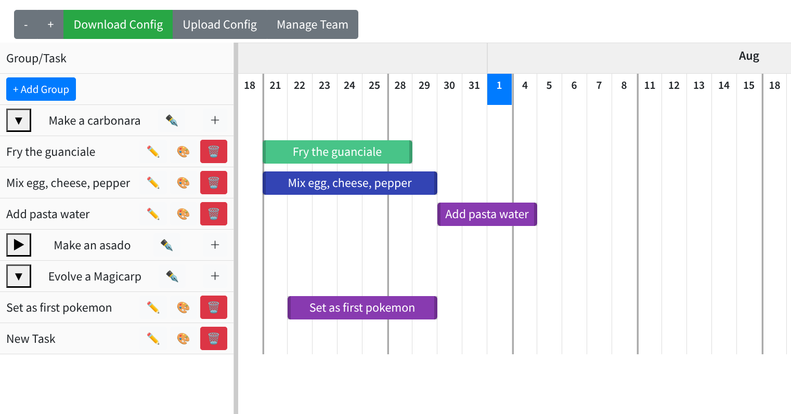

# GanttApp

I made this because Click*p charges 7 USD if you see your tasks in a Gantt chart too many times, even as a single user.

## Next steps
- Feat: if zoom level bellow 0.40, dont show the days of non-monday days(and make the monnday text to allow overflow)
- Feat: Alert when deleting a team member
- Feat: Add an assigned person per task.
- Feat: dragging groups and task to reorder them 
- Feat: the vertical scroll should not move the header
- Feat: dark theme icon
- Feat: the app is getting slow, probably because it calculates to many stuff on the fly

